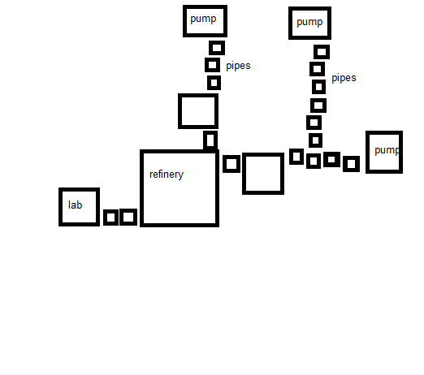
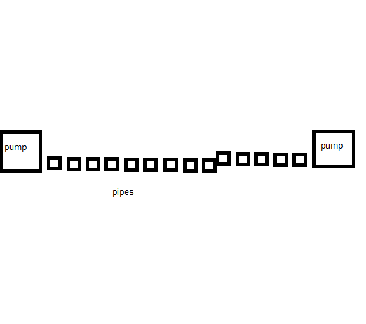
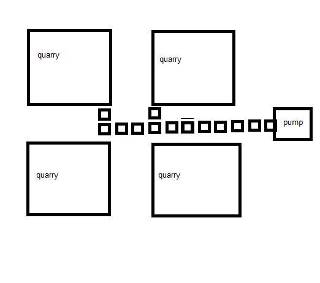
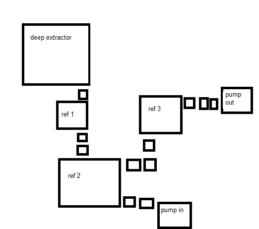
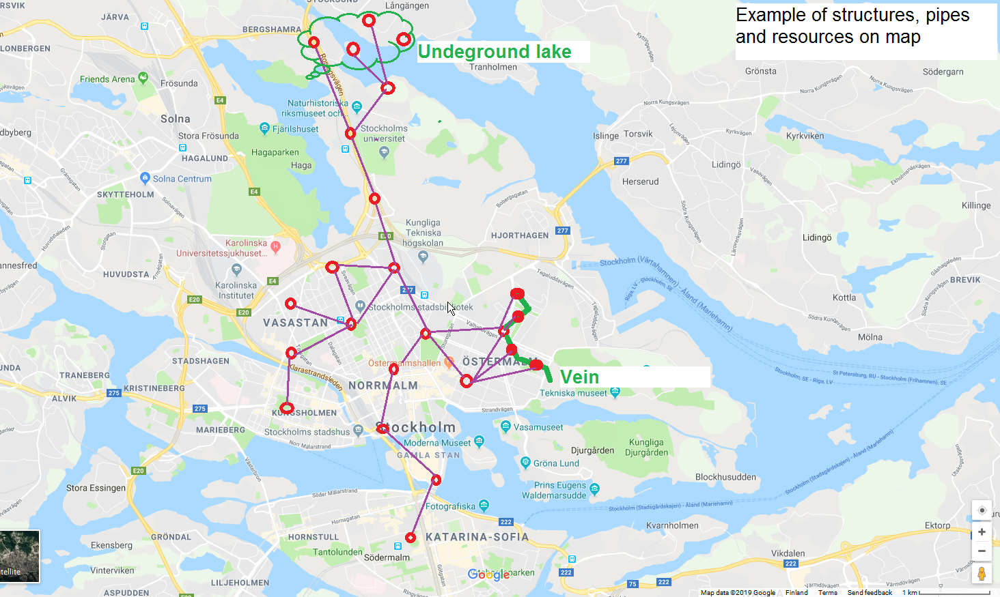

# Color planet industry expansion proposal

## Gameplay

* Build lab
* Research special scanner to detect low tier resources.
* Build factories that collect something and convert it to color resources.
** Player have to build factories on map and connect them.
* Research more structures by spending resources and transmitters
** Start gaining color resources per day
* Collect colors to team

Designed to allow current gameplay unchanged. Focused on teams. 

## Structures

Structure is similar to building, but have facilities inside with configuration screen. 

Each structure is belong to team, and players could see only their team structures.

One team may have 10-1000 structures. 

Structure is generic, and internal facilities will provide specific functionality.

Each structure should be at least 200-1000?m from other (only current team structures count).

To upgrade or modify structure, player need to be within 100m.

## Structure facilities

Similar as facilities that build around core in current game.

Each facility require workers to operate. User could permanently transfer his workers to facility.

Facilities don't have levels, and can't be upgraded. Structure could have multiple facilities of same type.

## List of facilities

* lab - used to research. 
* inner pipe - transfer single resource (E.g. Crude Rubinium) from one facility to another
* quarry/pumpjack/deepcoreextractor - get resource of specific tier (one per each color)
* refineries - convert resources to higher tiers
** E.g. Purified Rubinium <- Raw Rubinium <- Crude Rubinium <-Essence Rubinium
* pump in - accept resource through outer pipe connection
* pump out - send resource from structure to other structure through outer pipe connection
* storage - allow to store resources in that structure. E.g. 1000 of each.
* acceptor - user could transfer his purified resources and workers to that structure
* sender - allow to transfer purified resources to team.
* radar - make small area around structure visible
* treasure spawner - spawn treasure every 24h. That treasure can't be moved.
* research points collector - collect research points in 5km radius
* enemy research points collector - allow to collect research from every non-team transmitters. Value is /100 rounded down.

Structure with lab:

Structure with pumps, work as outer pump extender.

Structure with quarries, that collect raw resources and send them somewhere.

Structure with deep core extractor, that also convert resource to purified resource.

## List of new color tiers (for each color)

* purified - same as current colors
* raw - appears in veins
* crude - appears in underground lakes
* essence - could be build on top of existing fountain
These resources are not available for player directly, but could be converted to purified colors with multi-tier processing.

### Player could scan for veins/lakes

Similar to treasures. Will be visible for 6-48 hours, and then disappear permanently (if not captured). Other player also see them.
If player build structure and corresponding facility, vein/lake  become permanent for that team (until structure is demolished).

### Vein

Curved line about 50m wide and 1km long. Have limited number of random raw resource. 
Player have to build and demolish many structures to extract all of it. One structure covers ~100x100m area.

### Lake

~1x1km area. Random infinite crude resource. 3-5 structures with pumpjacks could fit into single field.

## Outer Pipes

Besides structures, player could build outer pipes, that transfer multiple resources, and basically connect structures.
To build pipe. Go to structure 1 location, in structure menu, select "build outer pipe". Travel to other structure and "complete pipe connection".
Player have limit of 1 hour to construct pipe. Pipe cost is based on distance between structures.

## Research

Research requires  purified resources (all colours) to start research.
Every depleted transmitter (year team) contribute its level to research progress. Works within 5km from research points collector.

## Tech tree (WIP)

Just ideas what could be researched. No actual tech tree yet.

* Longer outer pipes (initial length is 1km, max is ~50km). 
* Lower tiers of resources.
* Unlock facilities.
* Research efficiency. 
* Collector efficiency.
* Treasure spawner frequency.
* Line radar - item, allow to scan 50km in specific direction with ~100m width. 

## Why valuable to player?

And some outcome suggestions.

Spend 1000 of each resource to structures and facilities, will get 1 of each resource per day + very slow research.
Spend 1M of each resource to get 10K/day OR fast research OR 1K/day+average research speed.

## Random thoughts
  
Maybe possible to create specific transmitter parts from lowest tier (but very expensive).
Maybe possible to get some one-time tools (scanners, treasure finders, etc) also expensive.
Maybe possible to make "automatic transmitter deployer".
Energy as additional resource for structures to operate, and wires to connect structures.
